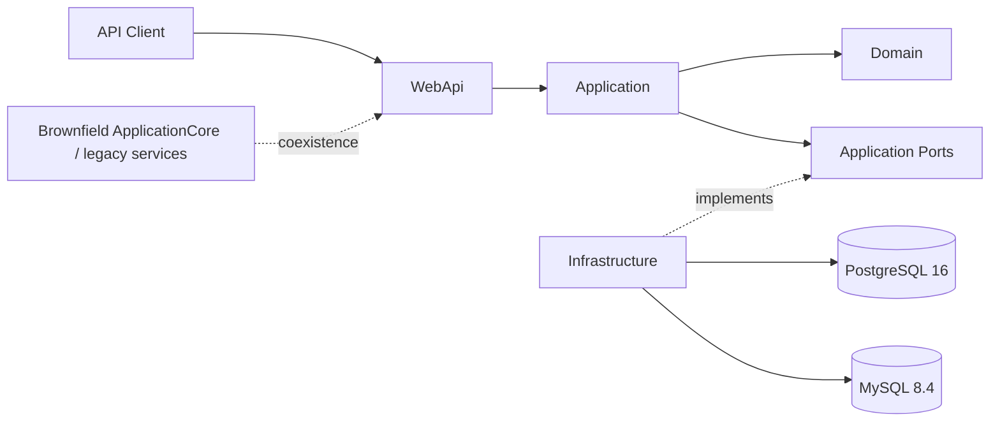

# eFactura

**Uruguay electronic invoicing and transactional sales modernization in .NET 10, built as a governed brownfield evolution toward Clean Architecture.**

[](https://github.com/LuisHdezE/efactura/actions/workflows/clean-architecture.yml)

> **Project status**  
> This repository is an active modernization project. It contains a legacy/brownfield baseline plus a newer v1 path that is being migrated incrementally under explicit architecture, persistence, security and review gates. It is not presented as a production-certified DGI solution.

## At a glance

| | |
|---|---|
| **Runtime** | .NET 10, SDK pinned to `10.0.400` |
| **Architecture direction** | Clean Architecture for the new v1 path, with brownfield coexistence |
| **API** | ASP.NET Core Web API |
| **Persistence** | Provider-neutral EF Core write path validated against PostgreSQL 16 and MySQL 8.4 |
| **Domain focus** | Sales, Catalog, Inventory, CAE/fiscal numbering, Finance foundations, fiscal calculation |
| **Reliability** | Explicit transactions, idempotency, audit evidence, outbox evidence, optimistic/unique concurrency guards |
| **Security gate** | Blocking NuGet known-vulnerability check |
| **Latest accepted transaction-foundation CI** | 264 / 264 represented automated tests PASS |

## What this project demonstrates

`eFactura` is a practical modernization of an existing accounting/electronic-invoicing backend toward a stricter, testable architecture for Uruguay-oriented electronic fiscal workflows.

The work deliberately evolves the system in bounded slices instead of rewriting everything at once. New v1 business behavior is introduced behind explicit Domain, Application, Infrastructure and Web API boundaries while historical code remains isolated as brownfield debt until it is migrated safely.

### Accepted capabilities on `main`

The current accepted `main` includes modernized foundations and executable slices for:

- parties and catalog foundations used by the new v1 path;
- sales draft, validation and fiscal preview;
- inventory availability and stock adjustments;
- CAE authorization lifecycle and atomic fiscal-number reservation;
- .NET 10 runtime and CI modernization;
- dependency-security hardening and retirement of AutoMapper from the new architecture path;
- Uruguay CFE 25.2 arithmetic foundation with source-controlled rule provenance;
- deterministic sale-confirmation planning;
- deterministic settlement planning;
- versioned PaymentMethod, immutable Payment and server-derived Receivable persistence foundations;
- tracked-stock sale-consumption effects;
- durable `FiscalizationRequest(PENDING)` work-item evidence;
- an atomic local sale-confirmation Application transaction that composes Finance, stock, fiscalization-request, audit, outbox and idempotency effects.

The public `confirmSale` Web API endpoint is **not** part of the accepted `main` baseline yet. It is being handled as a separate governed slice.

## Architecture



### New v1 dependency direction

```text
WebApi -> Application -> Domain
                   -> Ports <- Infrastructure
```

The modernization intentionally prevents new business use cases from drifting back into controller-owned transactions, repository-owned business orchestration or provider-specific persistence shortcuts.

The repository still contains historical `ApplicationCore` and legacy paths. Their presence is explicit brownfield coexistence, not the target architecture for new v1 work.

## Transaction and consistency model

The new write path uses application-owned transaction boundaries and portable persistence contracts.

Important guarantees already exercised by tests include:

- idempotent replay for retry-sensitive commands;
- audit and outbox evidence committed with business state;
- optimistic concurrency through expected-version checks;
- database uniqueness for selected business invariants;
- provider-neutral transaction behavior across PostgreSQL and MySQL;
- rollback of multi-effect operations after injected post-flush failures;
- server-owned authoritative evidence rather than trusting client-supplied totals, fiscal fingerprints or resulting balances.

The sale-confirmation transaction foundation currently coordinates:

```text
Validated Sale
  -> authoritative confirmation evidence
  -> settlement plan
  -> Payment and/or Receivable effects
  -> tracked-stock consumption
  -> FiscalizationRequest(PENDING)
  -> Sale CONFIRMED
  -> audit + outbox
  -> idempotency completion
```

CAE allocation and FiscalDocument/XML/signing/transport remain part of a later fiscalization workflow and are not hidden inside the local confirmation transaction.

## Uruguay fiscal foundation

The repository contains a bounded CFE 25.2 arithmetic foundation reviewed against official DGI evidence during the modernization work.

The current accepted arithmetic boundary includes:

- exact `decimal` arithmetic;
- two-decimal mathematical rounding for the supported Release-1 cases;
- item arithmetic based on quantity, unit price, discount and surcharge inputs;
- separate header buckets for supported fiscal indicators;
- VAT totals derived from authoritative taxable header buckets;
- source-controlled rule provenance;
- fail-closed behavior for unresolved or unsupported tax evidence.

This does **not** mean the repository already provides complete production CFE issuance or DGI homologation.

## Validation evidence

The project uses a dedicated **Clean Architecture Guard** workflow.

The latest accepted exact-head validation for the merged sale-confirmation transaction foundation reported:

| Suite | Result |
|---|---:|
| ArchitectureTests | 61 / 61 PASS |
| CrossCuttingTests | 61 / 61 PASS |
| UnitTest | 21 / 21 PASS |
| PersistenceIntegrationTests | 121 / 121 PASS |
| **Total represented** | **264 / 264 PASS** |

The same accepted run also reported:

- Release build: PASS, 0 errors;
- blocking NuGet vulnerability gate: PASS;
- 0 known vulnerable packages across the 10 solution projects;
- PostgreSQL 16 integration: PASS;
- MySQL 8.4 integration: PASS;
- application transaction rollback and replay scenarios: PASS.

Earlier accepted checkpoints and the full evidence trail are documented under [`documentation/`](documentation/).

## Repository map

```text
src/
  Domain/              New v1 domain model and fiscal/business rules
  Application/         New v1 use cases, planners and ports
  Infrastructure/      Persistence and external implementation details
  WebApi/              HTTP presentation and composition boundary
  ApplicationCore/     Historical brownfield application code
  Shared/              Shared legacy/supporting concerns

test/
  ArchitectureTests/           Executable dependency/boundary guards
  CrossCuttingTests/           Application and domain behavior
  PersistenceIntegrationTests/ PostgreSQL + MySQL persistence evidence
  UnitTest/                    Historical/legacy unit suite

documentation/
  BLUEPRINT_CURRENT_STATE.md
  blueprint-brownfield/
  blueprint-target/
  blueprint-architecture/
  blueprint-api-contract/
  blueprint-api-implementation/
```

## Modernization governance

The repository is evolved in small PR-scoped slices with exact-head validation and explicit human merge approval.

The human-readable checkpoint is maintained in:

[`documentation/BLUEPRINT_CURRENT_STATE.md`](documentation/BLUEPRINT_CURRENT_STATE.md)

Historical inspection and gap-analysis documents are intentionally preserved as provenance. They are not rewritten to make old AS-IS observations appear current.

## Local development

### Requirements

- .NET SDK **10.0.400** as pinned by [`global.json`](global.json)
- PostgreSQL and/or MySQL when running persistence integration scenarios

### Restore and build

```bash
dotnet --version
dotnet restore api-accounting.sln
dotnet build api-accounting.sln -c Release --no-restore
```

### Tests

```bash
dotnet test test/ArchitectureTests -c Release
dotnet test test/CrossCuttingTests -c Release
dotnet test test/UnitTest -c Release
```

`PersistenceIntegrationTests` require the database-provider environment used by the repository CI. The GitHub Actions workflow runs PostgreSQL 16 and MySQL 8.4 as disposable service containers.

## Current boundaries and intentional non-claims

The following are **not complete on the current accepted `main`** and should not be inferred from the implemented foundations:

- public `confirmSale` endpoint;
- final FiscalDocument identity and complete CFE issuance workflow;
- CFE XML generation;
- XML signing;
- certificate/private-key custody;
- transport to DGI or an external provider;
- final production choice between direct DGI and provider integration;
- correction-note lifecycle;
- contingency lifecycle;
- daily fiscal reporting and homologation evidence;
- production operational/SLA claims.

Open regulatory decisions remain open until separately reviewed against current official evidence.

## Why this repository matters as a portfolio project

This project is less about adding endpoints quickly and more about showing disciplined modernization of a risky transactional domain:

- preserve working brownfield behavior while introducing cleaner boundaries;
- make business rules server-authoritative;
- prove PostgreSQL/MySQL portability with integration tests;
- treat idempotency, concurrency, audit and rollback as first-class behavior;
- keep fiscal/regulatory assumptions explicit and evidence-backed;
- separate local sale confirmation from irreversible fiscalization concerns;
- evolve through small, reviewable, CI-certified increments.

## Maintainer note

The current modernization work and governance are maintained by **Luis A. Hernández Elias**. The repository contains historical brownfield code and documentation that predate parts of the current modernization, and that provenance is intentionally preserved rather than rewritten.
